# Diagram Podróży Użytkownika - Kanji Quiz

Ten diagram przedstawia kompleksową podróż użytkownika w aplikacji Kanji Quiz, obejmującą autentykację, tworzenie quizów, rozwiązywanie pytań oraz zarządzanie listą "Need Review".

```mermaid
stateDiagram-v2
    [*] --> StronaGlowna: Użytkownik otwiera aplikację

    state "Strona Główna" as StronaGlowna {
        [*] --> SprawdzenieAutentykacji
        state if_auth <<choice>>
        SprawdzenieAutentykacji --> if_auth
        if_auth --> PrzekierowanieDoDashboard: Zalogowany
        if_auth --> PrzekierowanieDoLogowania: Niezalogowany
    }

    state "Proces Rejestracji" as Rejestracja {
        [*] --> StronaRejestracji
        StronaRejestracji --> FormularzRejestracji
        
        FormularzRejestracji: Użytkownik wypełnia formularz
        note right of FormularzRejestracji
            Pola: email, hasło, potwierdzenie hasła
            Walidacja po stronie klienta:
            - Email: wymagany, poprawny format
            - Hasło: min 8 znaków, wielka/mała litera, cyfra
            - Potwierdzenie: zgodność z hasłem
        end note
        
        FormularzRejestracji --> WalidacjaRejestracji
        
        state if_validacja_rejestracji <<choice>>
        WalidacjaRejestracji --> if_validacja_rejestracji
        if_validacja_rejestracji --> WyslanieRejestracji: Dane poprawne
        if_validacja_rejestracji --> BledyWalidacjiRejestracji: Błędy walidacji
        
        BledyWalidacjiRejestracji --> FormularzRejestracji: Wyświetlenie błędów
        
        WyslanieRejestracji --> PrzetwarzanieRejestracji
        
        state if_rejestracja_sukces <<choice>>
        PrzetwarzanieRejestracji --> if_rejestracja_sukces
        if_rejestracja_sukces --> AutomatyczneLogowanie: Konto utworzone
        if_rejestracja_sukces --> BladRejestracji: Email już istnieje / błąd serwera
        
        BladRejestracji: Wyświetlenie komunikatu błędu
        note right of BladRejestracji
            Możliwe błędy:
            - Email już zarejestrowany (409)
            - Zbyt słabe hasło (400)
            - Błąd serwera (500)
        end note
        
        BladRejestracji --> FormularzRejestracji
        AutomatyczneLogowanie --> [*]
    }

    state "Proces Logowania" as Logowanie {
        [*] --> StronaLogowania
        StronaLogowania --> FormularzLogowania
        
        FormularzLogowania: Użytkownik wprowadza dane
        note right of FormularzLogowania
            Pola: email, hasło
            Opcje: pokaż/ukryj hasło
            Link: przejście do rejestracji
        end note
        
        FormularzLogowania --> WalidacjaLogowania
        
        state if_validacja_logowania <<choice>>
        WalidacjaLogowania --> if_validacja_logowania
        if_validacja_logowania --> WyslanieLogowania: Dane wypełnione
        if_validacja_logowania --> BledyWalidacjiLogowania: Puste pola
        
        BledyWalidacjiLogowania --> FormularzLogowania: Wyświetlenie błędów
        
        WyslanieLogowania --> PrzetwarzanieLogowania
        
        state if_logowanie_sukces <<choice>>
        PrzetwarzanieLogowania --> if_logowanie_sukces
        if_logowanie_sukces --> UtworzenieSesji: Poprawne dane
        if_logowanie_sukces --> BladLogowania: Niepoprawne dane / błąd
        
        BladLogowania: Ogólny komunikat błędu
        note right of BladLogowania
            Bezpieczeństwo: nie ujawniamy
            czy email istnieje w systemie
        end note
        
        BladLogowania --> FormularzLogowania
        UtworzenieSesji --> [*]
    }

    state "Dashboard Użytkownika" as Dashboard {
        [*] --> WidokDashboard
        
        WidokDashboard: Główny panel użytkownika
        note right of WidokDashboard
            Wyświetlane elementy:
            - Email użytkownika
            - Przycisk wylogowania
            - Sekcja tworzenia quizu
            - Lista "Need Review"
            - Historia quizów
        end note
        
        WidokDashboard --> WyborTypuQuizu
        
        state "Wybór Typu Quiz" as WyborTypuQuizu {
            [*] --> DecyzjaTypQuizu
            state if_typ_quizu <<choice>>
            DecyzjaTypQuizu --> if_typ_quizu
            if_typ_quizu --> KonfiguracjaQuizuPoziomowego: Quiz według poziomu
            if_typ_quizu --> KonfiguracjaQuizuNeedReview: Quiz z listy "Need Review"
            
            KonfiguracjaQuizuPoziomowego: Wybór parametrów
            note right of KonfiguracjaQuizuPoziomowego
                Parametry:
                - Poziom JLPT: N5, N4, N3, N2, N1
                - Liczba pytań: 10, 20, 50
            end note
            
            KonfiguracjaQuizuPoziomowego --> WalidacjaDostepnosci
            
            KonfiguracjaQuizuNeedReview: Wybór liczby pytań
            note right of KonfiguracjaQuizuNeedReview
                Limit: do liczby kanji na liście
                Jeśli lista pusta: komunikat i blokada
            end note
            
            KonfiguracjaQuizuNeedReview --> WalidacjaDostepnosci
            
            state if_dostepnosc <<choice>>
            WalidacjaDostepnosci --> if_dostepnosc
            if_dostepnosc --> TworzenieQuizu: Wystarczająco kanji
            if_dostepnosc --> KomunikatBrakuKanji: Za mało kanji
            
            KomunikatBrakuKanji --> DecyzjaTypQuizu
            TworzenieQuizu --> [*]
        }
        
        WidokDashboard --> ZarzadzanieNeedReview
        
        state "Lista Need Review" as ZarzadzanieNeedReview {
            [*] --> WyswietlenieListyNeedReview
            WyswietlenieListyNeedReview --> AkcjeNaLiscie
            
            state if_akcja_lista <<choice>>
            AkcjeNaLiscie --> if_akcja_lista
            if_akcja_lista --> UsuniecieZListy: Odznaczenie kanji
            if_akcja_lista --> UtworzQuizuNeedReview: Start quizu
            
            UsuniecieZListy --> WyswietlenieListyNeedReview
            UtworzQuizuNeedReview --> [*]
        }
        
        WidokDashboard --> PrzegladanieHistorii
        
        state "Historia Quizów" as PrzegladanieHistorii {
            [*] --> ListaHistorii
            
            ListaHistorii: Ukończone quizy
            note right of ListaHistorii
                Dla każdego quizu:
                - Data ukończenia
                - Poziom JLPT
                - Wynik (procent poprawnych)
                - Liczba pytań
            end note
            
            ListaHistorii --> WyborQuizuZHistorii
            
            state if_szczegoly <<choice>>
            WyborQuizuZHistorii --> if_szczegoly
            if_szczegoly --> SzczegolyQuizu: Kliknięcie w quiz
            if_szczegoly --> ListaHistorii: Powrót
            
            SzczegolyQuizu: Widok wszystkich kanji
            note right of SzczegolyQuizu
                Dla każdego kanji:
                - Znak kanji
                - Status: poprawne/błędne
                - Poprawna odpowiedź
            end note
            
            SzczegolyQuizu --> ListaHistorii
        }
        
        WidokDashboard --> Wylogowanie
    }

    state "Rozwiązywanie Quiz" as Quiz {
        [*] --> LadowanieQuizu
        
        LadowanieQuizu: Pobieranie danych quizu
        note right of LadowanieQuizu
            Wymaganie wydajności:
            Pierwsze pytanie < 5 sekund
            na połączeniu 3G
        end note
        
        state if_ladowanie_sukces <<choice>>
        LadowanieQuizu --> if_ladowanie_sukces
        if_ladowanie_sukces --> WyswietleniePytania: Dane załadowane
        if_ladowanie_sukces --> BladLadowania: Błąd pobierania
        
        BladLadowania: Komunikat błędu z opcją ponowienia
        BladLadowania --> LadowanieQuizu: Retry
        
        state "Pętla Pytań" as PetlaPytan {
            [*] --> WyswietleniePytania
            
            WyswietleniePytania: Prezentacja kanji
            note right of WyswietleniePytania
                Elementy:
                - Duży znak kanji na środku
                - Typ pytania: czytanie lub znaczenie
                - Pole tekstowe na odpowiedź
                - Wskaźnik postępu
                - Opcja oznaczenia "Need Review"
            end note
            
            WyswietleniePytania --> WprowadzanieOdpowiedzi
            WprowadzanieOdpowiedzi --> WalidacjaOdpowiedzi
            
            state if_odpowiedz <<choice>>
            WalidacjaOdpowiedzi --> if_odpowiedz
            if_odpowiedz --> WyslanieOdpowiedzi: Pole wypełnione
            if_odpowiedz --> WprowadzanieOdpowiedzi: Puste pole
            
            WyslanieOdpowiedzi --> SprawdzenieOdpowiedzi
            
            state if_poprawnosc <<choice>>
            SprawdzenieOdpowiedzi --> if_poprawnosc
            if_poprawnosc --> NatychmiastowyFeedbackPoprawny: Odpowiedź poprawna
            if_poprawnosc --> NatychmiastowyFeedbackBledny: Odpowiedź błędna
            
            NatychmiastowyFeedbackPoprawny: Komunikat sukcesu
            note right of NatychmiastowyFeedbackPoprawny
                Wyświetlane:
                - Zielony wskaźnik
                - Poprawna odpowiedź
                - Opcja "Need Review"
                - Przycisk "Dalej"
            end note
            
            NatychmiastowyFeedbackBledny: Komunikat błędu
            note right of NatychmiastowyFeedbackBledny
                Wyświetlane:
                - Czerwony wskaźnik
                - Podana odpowiedź użytkownika
                - Poprawna odpowiedź
                - Opcja "Need Review"
                - Przycisk "Dalej"
            end note
            
            NatychmiastowyFeedbackPoprawny --> OpcjaOznaczenia
            NatychmiastowyFeedbackBledny --> OpcjaOznaczenia
            
            state if_oznaczenie <<choice>>
            OpcjaOznaczenia --> if_oznaczenie
            if_oznaczenie --> DodanieDoNeedReview: Oznacz jako "Need Review"
            if_oznaczenie --> KolejnePytanie: Pomiń oznaczenie
            
            DodanieDoNeedReview --> KolejnePytanie
            
            state if_koniec_pytan <<choice>>
            KolejnePytanie --> if_koniec_pytan
            if_koniec_pytan --> WyswietleniePytania: Są jeszcze pytania
            if_koniec_pytan --> [*]: Wszystkie pytania ukończone
        }
        
        PetlaPytan --> PodsumowanieQuizu
        
        state "Zakończenie Quiz" as PodsumowanieQuizu {
            [*] --> WyswietlenieWynikow
            
            WyswietlenieWynikow: Modal z podsumowaniem
            note right of WyswietlenieWynikow
                Wyświetlane:
                - Wynik procentowy
                - Liczba poprawnych/błędnych
                - Lista wszystkich kanji
                - Opcje oznaczenia "Need Review"
                - Przycisk powrotu do dashboard
            end note
            
            WyswietlenieWynikow --> ZapisDoHistorii
            ZapisDoHistorii --> [*]
        }
    }

    state "Porzucenie Quiz" as PorzucenieQuizu {
        [*] --> DialogPotwierdzenia
        
        DialogPotwierdzenia: Pytanie o potwierdzenie
        note right of DialogPotwierdzenia
            Użytkownik może porzucić quiz
            w dowolnym momencie przez
            kliknięcie przycisku "Abandon"
        end note
        
        state if_potwierdzenie <<choice>>
        DialogPotwierdzenia --> if_potwierdzenie
        if_potwierdzenie --> UsuniecieQuizu: Potwierdzone
        if_potwierdzenie --> PowrotDoQuizu: Anulowane
        
        UsuniecieQuizu: Quiz nie trafia do historii
        note right of UsuniecieQuizu
            Zachowane:
            - Oznaczenia "Need Review"
            
            Usunięte:
            - Postęp quizu
            - Odpowiedzi
        end note
        
        UsuniecieQuizu --> [*]
        PowrotDoQuizu --> [*]
    }

    state "Wylogowanie" as Wylogowanie {
        [*] --> PotwierdzenieDziałania
        PotwierdzenieDziałania --> WyczyszczenieSesji
        WyczyszczenieSesji --> PrzekierowanieDoLogowania2: Sesja zakończona
    }

    PrzekierowanieDoLogowania --> Logowanie
    Logowanie --> AutomatyczneLogowanie
    AutomatyczneLogowanie --> Dashboard
    
    StronaGlowna --> Rejestracja: Przejście do rejestracji
    Rejestracja --> Dashboard
    
    PrzekierowanieDoDashboard --> Dashboard
    Dashboard --> Quiz: Start quizu
    Quiz --> PorzucenieQuizu: Kliknięcie "Abandon"
    PorzucenieQuizu --> Dashboard: Quiz porzucony
    Quiz --> Dashboard: Quiz ukończony
    
    Wylogowanie --> PrzekierowanieDoLogowania2
    PrzekierowanieDoLogowania2 --> Logowanie
    
    Dashboard --> [*]: Zamknięcie aplikacji
    Logowanie --> [*]: Zamknięcie przeglądarki
    Rejestracja --> [*]: Zamknięcie przeglądarki
```

## Kluczowe Punkty Podróży Użytkownika

### 1. Autentykacja
- **Nowi użytkownicy**: Muszą przejść przez proces rejestracji z walidacją hasła (min 8 znaków, wielka/mała litera, cyfra)
- **Powracający użytkownicy**: Logowanie przez email i hasło
- **Bezpieczeństwo**: Wszystkie funkcje aplikacji dostępne tylko dla zalogowanych użytkowników
- **Sesje**: Zarządzane przez Supabase Auth z automatycznym odświeżaniem tokenów

### 2. Dashboard
- Centralny punkt dostępu do wszystkich funkcji
- Tworzenie quizów według poziomu JLPT (N5-N1)
- Tworzenie quizów z listy "Need Review"
- Przeglądanie historii ukończonych quizów
- Zarządzanie listą kanji wymagających powtórki

### 3. Przepływ Quiz
- **Konfiguracja**: Wybór poziomu i liczby pytań (10, 20, 50)
- **Rozwiązywanie**: Pojedyncze kanji z pytaniem o czytanie lub znaczenie
- **Feedback**: Natychmiastowy po każdej odpowiedzi
- **Oznaczenia**: Możliwość dodania kanji do listy "Need Review" w trakcie lub po quizie
- **Wymaganie wydajnościowe**: Pierwsze pytanie ładuje się < 5 sekund na 3G

### 4. Zarządzanie Postępem
- **Historia**: Wszystkie ukończone quizy zapisane z datą, poziomem i wynikiem
- **Need Review**: Lista trudnych kanji z możliwością dedykowanego quizu
- **Porzucone quizy**: Nie trafiają do historii, ale oznaczenia "Need Review" są zachowane

### 5. Punkty Decyzyjne
- Autentykacja: zalogowany vs niezalogowany
- Typ quizu: poziomowy vs "Need Review"
- Podczas quizu: oznaczenie kanji jako "Need Review"
- Zakończenie: ukończenie vs porzucenie quizu
- Feedback: odpowiedź poprawna vs błędna

