# Diagram Architektury UI - Kanji Quiz

## Architektura Komponentów UI po wdrożeniu autentykacji

```mermaid
flowchart TD
    subgraph "Middleware & Auth"
        MW[Middleware Index]
        MW --> SUPABASE[Supabase Client]
        MW --> SESSION[Session w Locals]
        SESSION --> USER[User w Locals]
    end

    subgraph "Strony Autentykacji - Nowe"
        SIGNIN_PAGE["auth/signin.astro"]
        SIGNUP_PAGE["auth/signup.astro"]
        CALLBACK_PAGE["auth/callback.astro - Przyszłość"]
        
        SIGNIN_PAGE --> SIGNIN_FORM[SignInForm React]
        SIGNUP_PAGE --> SIGNUP_FORM[SignUpForm React]
        
        SIGNIN_FORM --> AUTH_CLIENT[Auth Client Service]
        SIGNUP_FORM --> AUTH_CLIENT
        
        AUTH_CLIENT --> API_SIGNIN[POST /api/auth/signin]
        AUTH_CLIENT --> API_SIGNUP[POST /api/auth/signup]
        AUTH_CLIENT --> API_SIGNOUT[POST /api/auth/signout]
        AUTH_CLIENT --> API_SESSION[GET /api/auth/session]
    end

    subgraph "API Auth Endpoints - Nowe"
        API_SIGNIN --> AUTH_SERVICE[AuthService]
        API_SIGNUP --> AUTH_SERVICE
        API_SIGNOUT --> AUTH_SERVICE
        API_SESSION --> AUTH_SERVICE
        
        AUTH_SERVICE --> AUTH_VALIDATION[Walidacja Zod Auth]
        AUTH_SERVICE --> AUTH_ERRORS[Błędy Autentykacji]
        AUTH_SERVICE --> SUPABASE
    end

    subgraph "Strona Główna - Zaktualizowana"
        INDEX_PAGE["index.astro"]
        INDEX_PAGE --> REQUIRE_GUEST[requireGuest Guard]
        INDEX_PAGE --> WELCOME[Welcome Astro]
        REQUIRE_GUEST --> |"Authenticated"| REDIRECT_DASHBOARD[Przekierowanie → /dashboard]
        REQUIRE_GUEST --> |"Guest"| REDIRECT_SIGNIN[Przekierowanie → /auth/signin]
    end

    subgraph "Dashboard - Zaktualizowany"
        DASHBOARD_PAGE["dashboard.astro"]
        DASHBOARD_PAGE --> REQUIRE_AUTH_DASH[requireAuth Guard]
        REQUIRE_AUTH_DASH --> |"Authenticated"| DASHBOARD_LAYOUT[DashboardLayout React]
        REQUIRE_AUTH_DASH --> |"Not Auth"| REDIRECT_SIGNIN
        
        DASHBOARD_LAYOUT --> DASHBOARD_HEADER[DashboardHeader - Zaktualizowany]
        DASHBOARD_LAYOUT --> QUIZ_CREATION[QuizCreationSection]
        DASHBOARD_LAYOUT --> NEED_REVIEW_SECTION[NeedReviewListSection]
        DASHBOARD_LAYOUT --> HISTORY_SECTION[HistorySection]
        
        DASHBOARD_HEADER --> |"userEmail z props"| DISPLAY_EMAIL[Wyświetlanie Email]
        DASHBOARD_HEADER --> |"onLogout"| API_SIGNOUT
        
        QUIZ_CREATION --> LEVEL_CARD[LevelQuizCard]
        QUIZ_CREATION --> NEED_REVIEW_CARD[NeedReviewQuizCard]
        
        LEVEL_CARD --> START_QUIZ_HOOK[useStartQuiz Hook]
        NEED_REVIEW_CARD --> START_QUIZ_HOOK
        
        START_QUIZ_HOOK --> API_CREATE_QUIZ[POST /api/quizzes]
        
        NEED_REVIEW_SECTION --> NEED_REVIEW_LIST[NeedReviewList]
        NEED_REVIEW_LIST --> NEED_REVIEW_ITEM[NeedReviewListItem]
        NEED_REVIEW_ITEM --> REMOVE_HOOK[useRemoveNeedReview]
        REMOVE_HOOK --> API_DELETE_NEED_REVIEW[DELETE /api/need-reviews/kanjiId]
        
        NEED_REVIEW_SECTION --> NEED_REVIEW_PAGINATION[NeedReviewPagination]
        NEED_REVIEW_SECTION --> USE_NEED_REVIEW_LIST[useNeedReviewList Hook]
        USE_NEED_REVIEW_LIST --> API_GET_NEED_REVIEWS[GET /api/need-reviews]
        
        HISTORY_SECTION --> HISTORY_LIST[HistoryList]
        HISTORY_LIST --> HISTORY_ACCORDION[HistoryItemAccordion]
        HISTORY_SECTION --> HISTORY_PAGINATION[HistoryPagination]
        HISTORY_SECTION --> USE_QUIZ_HISTORY[useQuizHistory Hook]
        USE_QUIZ_HISTORY --> API_GET_QUIZZES[GET /api/quizzes]
    end

    subgraph "Quiz View - Zaktualizowany"
        QUIZ_PAGE["quiz/id.astro"]
        QUIZ_PAGE --> REQUIRE_AUTH_QUIZ[requireAuth Guard]
        REQUIRE_AUTH_QUIZ --> |"Authenticated + userId"| QUIZ_SERVICE[QuizService SSR]
        REQUIRE_AUTH_QUIZ --> |"Not Auth"| REDIRECT_SIGNIN
        
        QUIZ_SERVICE --> |"getQuizById"| API_GET_QUIZ[GET /api/quizzes/id]
        QUIZ_SERVICE --> QUIZ_CONTAINER[QuizContainer React]
        
        QUIZ_CONTAINER --> ERROR_BOUNDARY[ErrorBoundary]
        QUIZ_CONTAINER --> TOAST_PROVIDER[ToastProvider]
        TOAST_PROVIDER --> USE_QUIZ_STATE[useQuizState Hook]
        
        USE_QUIZ_STATE --> QUIZ_HEADER[QuizHeader]
        USE_QUIZ_STATE --> QUIZ_CONTENT[QuizContent]
        USE_QUIZ_STATE --> COMPLETION_MODAL[CompletionModal]
        
        QUIZ_HEADER --> ABANDON_BUTTON[AbandonButton]
        ABANDON_BUTTON --> API_ABANDON[POST /api/quizzes/id/abandon]
        
        QUIZ_CONTENT --> CURRENT_QUESTION[CurrentQuestion]
        CURRENT_QUESTION --> KANJI_DISPLAY[KanjiDisplay]
        CURRENT_QUESTION --> QUESTION_PROMPT[QuestionPrompt]
        CURRENT_QUESTION --> ANSWER_INPUT[AnswerInput]
        CURRENT_QUESTION --> SUBMIT_BUTTON[SubmitButton]
        CURRENT_QUESTION --> FEEDBACK_SECTION[FeedbackSection]
        
        FEEDBACK_SECTION --> CORRECTNESS_INDICATOR[CorrectnessIndicator]
        FEEDBACK_SECTION --> CORRECT_ANSWERS_LIST[CorrectAnswersList]
        
        QUIZ_CONTENT --> NEED_REVIEW_TOGGLE[NeedReviewToggle]
        QUIZ_CONTENT --> NEXT_QUESTION_BUTTON[NextQuestionButton]
        QUIZ_CONTENT --> PROGRESS_INDICATOR[ProgressIndicator]
        
        SUBMIT_BUTTON --> API_SUBMIT_ANSWER[PATCH /api/quizzes/quizId/questions/questionId]
        NEED_REVIEW_TOGGLE --> API_ADD_NEED_REVIEW[POST /api/need-reviews]
        NEED_REVIEW_TOGGLE --> API_DELETE_NEED_REVIEW
        
        NEXT_QUESTION_BUTTON --> |"Ostatnie pytanie"| API_COMPLETE[POST /api/quizzes/id/complete]
        
        COMPLETION_MODAL --> SCORE_SUMMARY[ScoreSummary]
        COMPLETION_MODAL --> RETURN_DASHBOARD_BUTTON[ReturnToDashboardButton]
        RETURN_DASHBOARD_BUTTON --> REDIRECT_DASHBOARD
    end

    subgraph "API Endpoints - Zaktualizowane z Auth"
        API_CREATE_QUIZ --> REQUIRE_AUTH_API[requireAuthAPI Guard]
        API_GET_QUIZ --> REQUIRE_AUTH_API
        API_SUBMIT_ANSWER --> REQUIRE_AUTH_API
        API_ABANDON --> REQUIRE_AUTH_API
        API_COMPLETE --> REQUIRE_AUTH_API
        API_GET_NEED_REVIEWS --> REQUIRE_AUTH_API
        API_ADD_NEED_REVIEW --> REQUIRE_AUTH_API
        API_DELETE_NEED_REVIEW --> REQUIRE_AUTH_API
        API_GET_QUIZZES --> REQUIRE_AUTH_API
        
        REQUIRE_AUTH_API --> |"userId z locals"| QUIZ_SERVICE_API[QuizService]
        REQUIRE_AUTH_API --> |"userId z locals"| NEED_REVIEW_SERVICE[NeedReviewService]
        REQUIRE_AUTH_API --> |"userId z locals"| KANJI_SERVICE[KanjiService]
        
        QUIZ_SERVICE_API --> QUIZ_VALIDATION[Walidacja Zod Quiz]
        NEED_REVIEW_SERVICE --> NEED_REVIEW_VALIDATION[Walidacja Zod Need Review]
        KANJI_SERVICE --> KANJI_VALIDATION[Walidacja Zod Kanji]
        
        QUIZ_SERVICE_API --> QUIZ_ERRORS[Błędy Quiz]
        NEED_REVIEW_SERVICE --> NEED_REVIEW_ERRORS[Błędy Need Review]
    end

    subgraph "Komponenty UI Współdzielone - Shadcn"
        BUTTON[Button]
        CARD[Card]
        DIALOG[Dialog]
        RADIO_GROUP[RadioGroup]
        SELECT[Select]
        SKELETON[Skeleton]
        ACCORDION[Accordion]
    end

    subgraph "Layout"
        LAYOUT["Layout.astro"]
        LAYOUT --> |"Wrapper dla wszystkich stron"| GLOBAL_CSS[Global CSS]
    end

    subgraph "Typy i DTOs"
        AUTH_TYPES[Auth Types & DTOs]
        DASHBOARD_TYPES[Dashboard Types & ViewModels]
        QUIZ_TYPES[Quiz Types & ViewModels]
        SHARED_TYPES[Shared Types - types.ts]
        
        SHARED_TYPES --> AUTH_TYPES
        SHARED_TYPES --> DASHBOARD_TYPES
        SHARED_TYPES --> QUIZ_TYPES
    end

    MW -.->|"Dostarcza session"| DASHBOARD_PAGE
    MW -.->|"Dostarcza session"| QUIZ_PAGE
    MW -.->|"Dostarcza session"| SIGNIN_PAGE
    MW -.->|"Dostarcza session"| SIGNUP_PAGE
    MW -.->|"Dostarcza session"| INDEX_PAGE

    LAYOUT -.->|"Otacza"| DASHBOARD_PAGE
    LAYOUT -.->|"Otacza"| QUIZ_PAGE
    LAYOUT -.->|"Otacza"| SIGNIN_PAGE
    LAYOUT -.->|"Otacza"| SIGNUP_PAGE
    LAYOUT -.->|"Otacza"| INDEX_PAGE

    BUTTON -.->|"Używany w"| DASHBOARD_HEADER
    BUTTON -.->|"Używany w"| SIGNIN_FORM
    BUTTON -.->|"Używany w"| SIGNUP_FORM
    BUTTON -.->|"Używany w"| SUBMIT_BUTTON
    BUTTON -.->|"Używany w"| ABANDON_BUTTON
    
    CARD -.->|"Używany w"| LEVEL_CARD
    CARD -.->|"Używany w"| NEED_REVIEW_CARD
    
    DIALOG -.->|"Używany w"| COMPLETION_MODAL
    DIALOG -.->|"Używany w"| CONFIRMATION_DIALOG[ConfirmationDialog]
    
    SKELETON -.->|"Używany w"| SECTION_SKELETON[SectionSkeleton]
    ACCORDION -.->|"Używany w"| HISTORY_ACCORDION

    classDef newComponent fill:#90EE90,stroke:#228B22,stroke-width:2px
    classDef updatedComponent fill:#FFD700,stroke:#FFA500,stroke-width:2px
    classDef apiComponent fill:#87CEEB,stroke:#4682B4,stroke-width:2px
    classDef serviceComponent fill:#DDA0DD,stroke:#9370DB,stroke-width:2px
    classDef guardComponent fill:#FF6B6B,stroke:#C92A2A,stroke-width:2px

    class SIGNIN_PAGE,SIGNUP_PAGE,CALLBACK_PAGE,SIGNIN_FORM,SIGNUP_FORM,AUTH_CLIENT,API_SIGNIN,API_SIGNUP,API_SIGNOUT,API_SESSION,AUTH_SERVICE,AUTH_VALIDATION,AUTH_ERRORS newComponent
    class INDEX_PAGE,DASHBOARD_PAGE,QUIZ_PAGE,DASHBOARD_HEADER updatedComponent
    class API_CREATE_QUIZ,API_GET_QUIZ,API_SUBMIT_ANSWER,API_ABANDON,API_COMPLETE,API_GET_NEED_REVIEWS,API_ADD_NEED_REVIEW,API_DELETE_NEED_REVIEW,API_GET_QUIZZES apiComponent
    class QUIZ_SERVICE,QUIZ_SERVICE_API,NEED_REVIEW_SERVICE,KANJI_SERVICE serviceComponent
    class REQUIRE_AUTH_DASH,REQUIRE_AUTH_QUIZ,REQUIRE_AUTH_API,REQUIRE_GUEST guardComponent
```



## Legenda

### Kolory komponentów:

- 🟢 **Zielony** - Nowe komponenty wprowadzone przez moduł autentykacji
- 🟡 **Żółty** - Zaktualizowane istniejące komponenty
- 🔵 **Niebieski** - Endpointy API
- 🟣 **Fioletowy** - Usługi backendowe
- 🔴 **Czerwony** - Auth Guards (ochrona)

### Typ linii:

- **Strzałka ciągła (→)** - Bezpośrednia zależność/przepływ danych
- **Linia kropkowana (-.->)** - Użycie/otoczenie przez komponent

## Kluczowe Zmiany w Architekturze

### 1. Nowe Strony Autentykacji
- `auth/signin.astro` - Strona logowania z formularzem React
- `auth/signup.astro` - Strona rejestracji z formularzem React
- Obie strony korzystają z `requireGuest` guard aby przekierować zalogowanych użytkowników

### 2. Auth Guards
- `requireAuth` - Chroni dashboard i quiz przed niezalogowanymi
- `requireGuest` - Chroni strony auth przed zalogowanymi
- `requireAuthAPI` - Chroni wszystkie endpointy API

### 3. Middleware Enhancement
- Pobiera sesję na każde żądanie
- Dodaje `session` i `user` do `context.locals`
- Dostępne we wszystkich stronach Astro i endpointach API

### 4. DashboardHeader Update
- Przyjmuje prawdziwy `userEmail` jako props
- Funkcjonalny przycisk logout wywołujący API

### 5. Usunięcie DEFAULT_USER_ID
- Wszystkie endpointy API używają `userId` z `locals.user`
- `quiz/[id].astro` pobiera userId z sesji zamiast DEFAULT_USER_ID

### 6. Przepływ Autentykacji

#### Rejestracja:
```
SignUpForm → POST /api/auth/signup → AuthService.signUp() → Auto-login → Dashboard
```

#### Logowanie:
```
SignInForm → POST /api/auth/signin → AuthService.signIn() → Session Cookies → Dashboard
```

#### Logout:
```
DashboardHeader → POST /api/auth/signout → AuthService.signOut() → Clear Cookies → Signin
```

### 7. Ochrona Stron

#### Strony publiczne (tylko dla gości):
- `/` - Przekierowanie do `/dashboard` jeśli zalogowany
- `/auth/signin` - Przekierowanie do `/dashboard` jeśli zalogowany
- `/auth/signup` - Przekierowanie do `/dashboard` jeśli zalogowany

#### Strony chronione (tylko dla zalogowanych):
- `/dashboard` - Przekierowanie do `/auth/signin` jeśli niezalogowany
- `/quiz/[id]` - Przekierowanie do `/auth/signin?redirect=/quiz/[id]` jeśli niezalogowany

### 8. Struktura Hooked Data Fetching

#### Dashboard:
- `useNeedReviewList` - Pobiera listę kanji do przeglądu (paginowana)
- `useQuizHistory` - Pobiera historię ukończonych quizów (paginowana)
- `useStartQuiz` - Tworzy nowy quiz
- `useRemoveNeedReview` - Usuwa kanji z listy przeglądu

#### Quiz:
- `useQuizState` - Kompleksowy hook zarządzający stanem quizu
  - Nawigacja między pytaniami
  - Wysyłanie odpowiedzi
  - Toggle need review
  - Porzucanie i ukończanie quizu

### 9. Error Handling

Wszystkie komponenty React wykorzystują:
- `ErrorBoundary` - Łapie błędy renderowania
- `ToastProvider` - Wyświetla powiadomienia o błędach API
- Specyficzne klasy błędów dla różnych scenariuszy (Auth, Quiz, NeedReview)

### 10. Validation Layers

Trzy warstwy walidacji:
1. **Client-side** - Formularze React (przed wysłaniem)
2. **Schema** - Zod validation w API endpoints
3. **Service** - Business logic validation w serwisach

## Przepływ Danych przez System

### 1. Autentykacja użytkownika:
```
User Input → SignInForm → Auth API → Supabase Auth → Session Cookies → Middleware → All Pages
```

### 2. Tworzenie quizu:
```
LevelQuizCard → useStartQuiz → POST /api/quizzes → QuizService → Redirect to /quiz/[id]
```

### 3. Rozwiązywanie quizu:
```
AnswerInput → useQuizState → PATCH /api/questions/[id] → QuizService → Updated Question State
```

### 4. Dodawanie do Need Review:
```
NeedReviewToggle → toggleNeedReview → POST /api/need-reviews → NeedReviewService → DB Update
```

### 5. Wylogowanie:
```
DashboardHeader Logout → POST /api/auth/signout → AuthService → Clear Session → Redirect to Signin
```

## Komponenty Współdzielone (Reusable)

### Shadcn UI Components:
Używane w całej aplikacji dla spójnego designu:
- **Button** - Wszystkie akcje użytkownika
- **Card** - Kontenery dla sekcji (Level Quiz, Need Review Quiz)
- **Dialog** - Modals (Completion, Confirmation)
- **Accordion** - Historia quizów (rozwijane elementy)
- **Select** - Dropdowns (wybór poziomu JLPT)
- **RadioGroup** - Wybór liczby pytań
- **Skeleton** - Loading states

### Custom Hooks:
- **useDashboardData** - Fetching danych dla dashboardu
- **useQuizState** - Stan i logika quizu
- **useToast** - System powiadomień

### Custom Components:
- **ErrorBoundary** - Obsługa błędów React
- **InlineAlert** - Wyświetlanie alertów
- **SectionSkeleton** - Loading skeleton dla sekcji
- **ConfirmationDialog** - Dialog potwierdzenia akcji

## Security & Performance

### Security:
- Wszystkie endpointy API chronione przez `requireAuthAPI`
- Session validation na poziomie middleware
- HttpOnly cookies (zapobieganie XSS)
- RLS policies w Supabase (do włączenia w produkcji)

### Performance:
- Server-Side Rendering (SSR) dla stron Astro
- Client-Side Hydration dla interaktywnych komponentów React
- Lazy loading komponentów React (`client:load`, `client:only`)
- Paginacja dla długich list (Need Review, History)
- Optimistic updates (Need Review Toggle)
- Minimum loading time dla lepszego UX (300ms)

## Typy i Modele Danych

### Separacja odpowiedzialności:
1. **DTOs** (`/src/types.ts`) - Komunikacja API (Request/Response)
2. **ViewModels** (`/src/components/types/`) - Stan komponentów UI
3. **Service Types** (`/src/lib/services/types/`) - Parametry i wyniki serwisów
4. **Database Types** (`/src/db/database.types.ts`) - Typy Supabase

Ta separacja zapewnia:
- Jasny kontrakt między warstwami
- Łatwą evolucję API bez wpływu na UI
- Type safety w całym stacku

## Podsumowanie Architektury

Architektura aplikacji Kanji Quiz jest zbudowana na trzech głównych warstwach:

1. **Warstwa Prezentacji** - Strony Astro + Komponenty React
2. **Warstwa API** - REST endpoints z auth guards i walidacją
3. **Warstwa Danych** - Supabase (Auth + Database)

Middleware działa jako most między warstwami, zapewniając dostęp do sesji i użytkownika w całej aplikacji.

Moduł autentykacji został zintegrowany z minimalnym wpływem na istniejące komponenty, głównie przez:
- Dodanie auth guards
- Przekazanie prawdziwego userId zamiast DEFAULT_USER_ID
- Aktualizację DashboardHeader z funkcjonalnym logout
- Dodanie przekierowań w index.astro

System jest gotowy do rozbudowy o:
- OAuth providers (Google, GitHub)
- Password recovery
- Email verification
- MFA (Multi-Factor Authentication)
